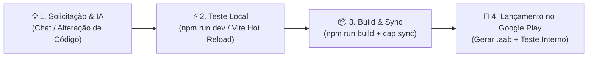

# 🔄 Fluxo de Desenvolvimento Contínuo e Lançamento (com IA) — Hexa Infinity

Este documento descreve o fluxo de trabalho ágil para solicitar alterações de código, testar localmente em tempo real e publicar novas versões para os testadores no Google Play Console.

---



---

## 1. Solicitar Alterações com a IA

Você pode solicitar qualquer tipo de melhoria ou correção diretamente no chat com o assistente de IA.

### Exemplos de solicitações comuns:
- **Jogabilidade & Mecânicas 3D:** Modificações de regras, balanceamento de pontuação, novos combos, animações no Three.js.
- **Interface & Design:** Cores, temas, layout da loja, telas de Game Over ou Segunda Chance, feedback tátil/visual.
- **Power-ups & Monetização:** Criação de novos pacotes, promoções, ajustes de inventário e compras IAP (RevenueCat / Google Play).
- **Correção de Bugs:** Ajustes de layout em diferentes tamanhos de tela, erros de sincronização com o Supabase, etc.

> 💡 **Boas Práticas:**
> - Trabalhe em ciclos incrementais (1 a 2 melhorias por vez).
> - Envie prints ou mensagens de erro quando quiser ajustes visuais específicos ou depuração rápida.

---

## 2. Testar Localmente em Tempo Real (Vite Hot Reload)

Para validar as alterações instantaneamente sem precisar compilar o aplicativo Android:

1. Inicie o servidor de desenvolvimento local:
   ```bash
   npm run dev
   ```
2. Abra no navegador:
   - **No PC:** `http://localhost:5173` (pressione `F12` e ative o modo mobile para simular a tela do smartphone).
   - **No Celular (mesma rede Wi-Fi):** Acesse o IP de rede informado no terminal (ex: `http://192.168.1.X:5173`).
3. **Hot Module Replacement (HMR):** Cada arquivo alterado pela IA atualiza a tela em menos de 1 segundo.
4. Peça refinamentos à IA até o resultado visual e a jogabilidade estarem exatamente como você deseja.

---

## 3. Preparar o Pacote Android (Build & Versionamento)

Quando o teste local estiver aprovado, feche a versão para o aplicativo Android nativo:

### 3.1. Incrementar a Versão
No arquivo [`android/app/build.gradle`](file:///android/app/build.gradle):
- Aumente o `versionCode` (ex: de `2` para `3`).
- Atualize o `versionName` (ex: de `"1.0.1"` para `"1.0.2"`).
*(Você também pode simplesmente pedir à IA para atualizar a versão para você!)*

### 3.2. Gerar o Build e Sincronizar com o Capacitor
Execute os comandos no terminal do projeto:
```bash
# Compilar o bundle web otimizado
npm run build

# Sincronizar os assets e plugins com o projeto Android
npx cap sync
```

---

## 4. Gerar o Pacote (.aab) e Publicar no Google Play Console

### 4.1. Gerar o Android App Bundle no Android Studio
1. Abra o Android Studio (`npx cap open android`).
2. No menu superior, vá em **Build** > **Generate Signed Bundle / APK...**.
3. Selecione **Android App Bundle** (`.aab`) e clique em **Next**.
4. Confirme a chave de assinatura (`.jks`), as senhas e o alias da chave > clique em **Next**.
5. Selecione a variante de build **release** e clique em **Create**.
6. Aguarde a finalização da compilação e clique em **locate** no pop-up de notificação para abrir a pasta do arquivo `app-release.aab`.

### 4.2. Publicar na Faixa de Teste Interno
1. Acesse o [Google Play Console](https://play.google.com/console).
2. Selecione o app **Hexa Infinity**.
3. No menu lateral, acesse **Teste** > **Teste interno** (*Internal testing*).
4. Clique no botão azul **Criar nova versão** (*Create new release*).
5. Faça o upload do novo arquivo `app-release.aab`.
6. Insira uma breve nota de versão (ex: *"Melhorias no design e balanceamento de pontuação"*).
7. Clique em **Próximo** > **Salvar e publicar**.

---

## 5. Atualização no Celular dos Testadores

- Em poucos minutos após a publicação, os testadores receberão a atualização diretamente pela **Google Play Store**.
- Eles podem abrir a Play Store no celular, buscar por **Hexa Infinity** e tocar em **Atualizar**.
- Todos os dados de login, pontuações e inventário do Supabase permanecem preservados entre as atualizações.
